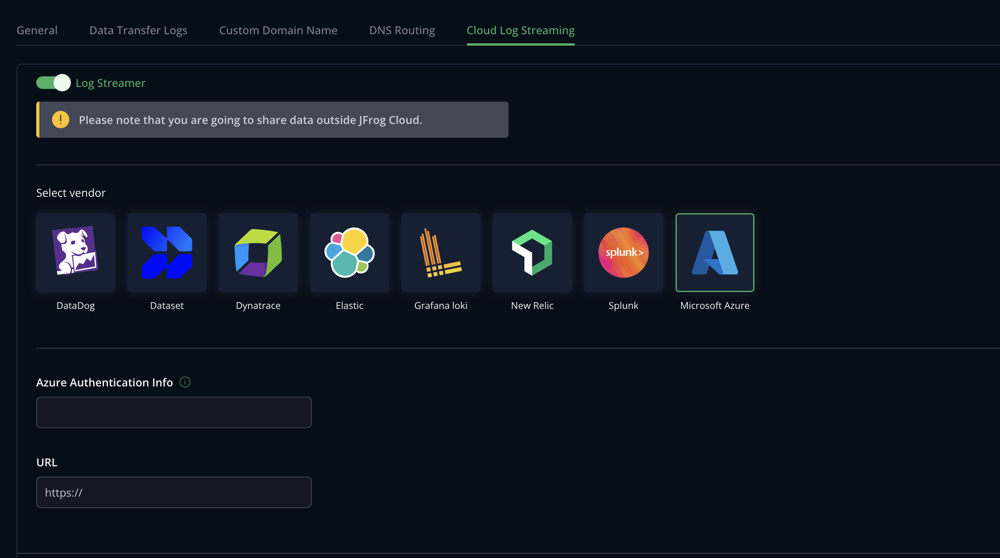

## Set up Cloud Log Streaming with Azure Log Analytics
### Create resources needed to stream logs to Azure Log Analytics. Logs can be used by MS Sentinel.

Note: **all resources must be created in the same region**.

1. Create new Resource group.
2. Create Log Analytics workspace, save resource ID for future reference.
3. Create MS Sentinel instance in the created workspace.
4. Create a new application in MS Entra (or use existing one).
5. Create new application secret (copy the secret and secret ID, it will be needed later).
6. Create Data Collection Endpoint (copy resource ID from JSON view, it will be needed later).

#### Template

>Note: data types across the attributes in Custom Tables and in Data Collection rules should match.

1. Create a new custom table(s) using Powershell commands in [new_table_powershell.txt](assets/new_table_powershell.txt)
2. Create a new Data Collection Rules using [ARM template](assets/dcr_template.json) (use Deploy a Custom Template functionality). As a result one DCRs will be created with five `streamDeclarations` one per each log type. 
3. After deployment click on `Configure DCE` button and select Data Collection Endpoint, created before. It's not assigned by default.

#### Access
1. Go to Access control (IAM) in Data Collection Rule resource.
2. Click on `Add` -> `Add role assignment`.
3. Select `Monitoring Metrics Publisher` job function role.
4. Select the application, for which we created the secret.

### MyJFrog Configuration
1. Go to the [MyJFrog Portal](http://my.jfrog.com/).
2. Additionally, you can access the MyJFrog Portal from the JFrog Platform. For more information, see [Platform Single Sign-On to MyJFrog](https://jfrog.com/help/r/5H19DEVA7PsahAXH0xXNSg/_iPFuW3rDQk_mlAk9URBkQ).
> Note: You must be a Platform Admin to access the MyJFrog Portal via the JFrog Platform.

Log into the JFrog Platform, and in the left navigation bar of the **Application** module, click **MyJFrog Portal**.
This opens the **MyJFrog Portal** in a new tab in your browser.

3. Select **Settings** from the left navigation menu.

4. Select the **JFrog Cloud Log Streaming** tab.

5. Turn on the **Log Streaming** toggle.

6. Select **Microsoft Azure**.




7. Paste Data Collection Endpoint URL into URL field (format `https://<workspace-name>.<region>.ingest.monitor.azure.com`)

8. Paste the following JSON into **Azure Authentication Info** field:

* `Secret` - Azure application secret.
* `AzureTenantId` - Application Tenant ID 
* `AzureClientId` - Application Client ID.
* `AzureDataCollectionRule` - Name of Data Collection Rule, `Immutable ID` in format `dcr-xxxxxxxxxxxxxxxxxxxxxxxxxxxxxxxx`

Names of the streams are the same as set in the script, which created the custom tables. 

```
{
    "Secret": "<AzureClientSecret>",
    "AzureTenantId": "<AzureTenantId>",
    "AzureClientId": "<AzureClientId>",
    "AzureDataCollectionRule": "<dcr-xxxxx>",
    "AzureRequestLogStreamName": "Custom-ArtifactoryRequestLogRawData",
    "AzureAccessLogStreamName": "Custom-ArtifactoryAccessLogRawData",
    "AzureAccessAuditLogStreamName": "Custom-ArtifactoryAccessAuditLogRawData",
    "AzureAccessSecurityLogStreamName": "Custom-ArtifactoryAccessSecurityAuditLogRawData",
    "AzureTrafficLogStreamName": "Custom-ArtifactoryTrafficLogRawData"
}
```

9. Click **Save**.
