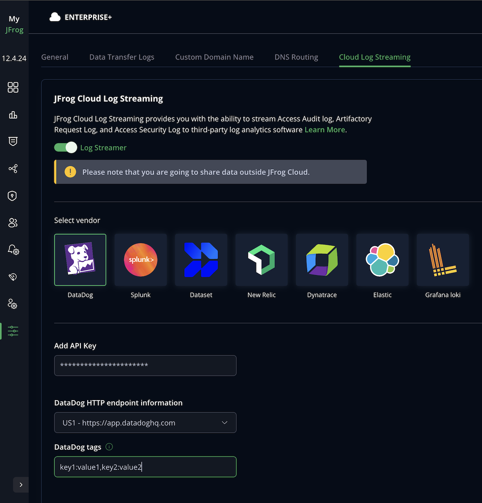

## Set up Cloud Log Streaming with Datadog

Perform the following steps to set up log streaming with Datadog.

1. Fetch **Datadog API key** from the [Organization Settings](https://app.datadoghq.com/organization-settings/api-keys) page in Datadog.
For more information, refer to the [Datadog documentation](https://docs.datadoghq.com/account_management/api-app-keys/).

2. Identify your **Datadog URL** based on the location as listed in the [table](https://docs.datadoghq.com/getting_started/site/#access-the-datadog-site) in Datadog documentation.

3. Form a key-value pair of any additional parameters that you need to add to the logs in the following format:
```
key1:value1,key2:value2
```
For example, `env:staging,version:5.1.`

4. Go to the [MyJFrog Portal](http://my.jfrog.com/).
5. Additionally, you can access the MyJFrog Portal from the JFrog Platform. For more information, see [Platform Single Sign-On to MyJFrog](https://jfrog.com/help/r/5H19DEVA7PsahAXH0xXNSg/_iPFuW3rDQk_mlAk9URBkQ).

> Note: You must be a Platform Admin to access the MyJFrog Portal via the JFrog Platform.

Log into the JFrog Platform, and in the left navigation bar of the **Application** module, click **MyJFrog Portal**.
This opens the **MyJFrog Portal** in a new tab in your browser.

6. Select **Settings** from the left navigation menu.

7. Select the **JFrog Cloud Log Streaming** tab.

8. Turn on the **Log Streaming** toggle.

9. Select **Datadog**.




10. Enter the **Datadog API key** and select **Datadog URL** from the dropdown list.

11. Enter the key-value pair that you formed in the **Datadog Tags** field.

12. Click **Save**.

The example dashboard will be installed together with the [JFrog Cloud integration](https://docs.datadoghq.com/integrations/jfrog_platform_cloud/), which can be found in the Integrations menu in Datadog.