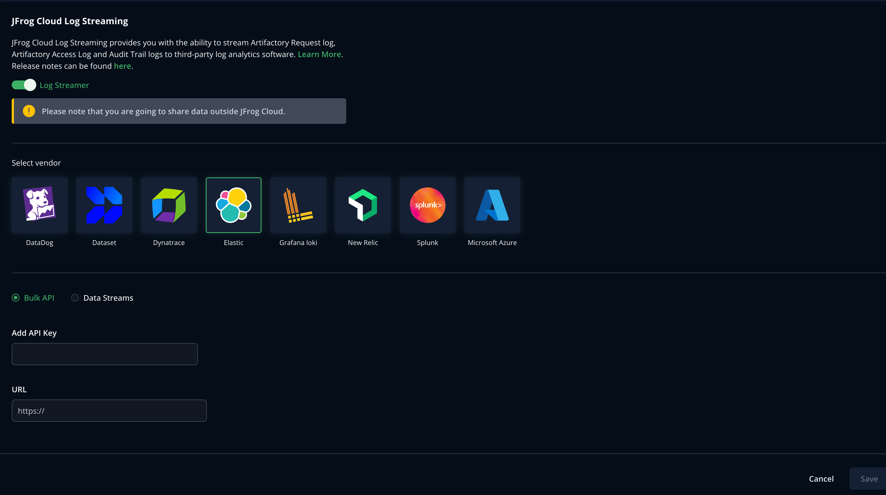

## Set up Cloud Log Streaming with Elastic

Perform the following steps to set up log streaming with Elastic.

1. Generate a new token in Elastic.

2. Go to the [MyJFrog Portal](http://my.jfrog.com/).

3. Additionally, you can access the MyJFrog Portal from the JFrog Platform. For more information, see [Platform Single Sign-On to MyJFrog](https://jfrog.com/help/r/5H19DEVA7PsahAXH0xXNSg/_iPFuW3rDQk_mlAk9URBkQ).

> Note: You must be a Platform Admin to access the MyJFrog Portal via the JFrog Platform.

Log into the JFrog Platform, and in the left navigation bar of the **Application** module, click **MyJFrog Portal**.
This opens the **MyJFrog Portal** in a new tab in your browser.

4. Select **Settings** from the left navigation menu.

5. Select the **JFrog Cloud Log Streaming** tab.

6. Turn on the **Log Streaming** toggle.

7. Select **Elastic**.

8. Click **Save**.