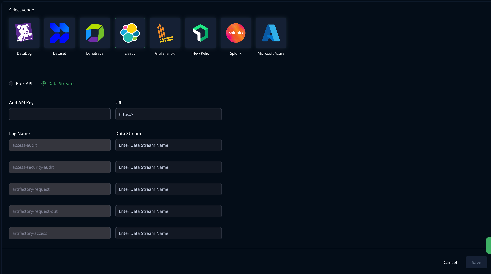

## Set up Cloud Log Streaming with Elastic Data Streams

Perform the following steps to set up log streaming with Elastic.

1. Generate a new API key in [Elastic](https://www.elastic.co/guide/en/kibana/current/api-keys.html).
   Api key should have following privileges:

```
"cluster": [
        "manage_index_templates",
        "monitor"
      ],
"indices": [
  {
    "names": ["<data-stream-name>*"],
    "privileges": [
      "create_index",
      "write",
      "read",
      "manage",
      "auto_configure"
    ]
  }
]
```
For more information, see [Elasticsearch privileges](https://www.elastic.co/docs/deploy-manage/users-roles/cluster-or-deployment-auth/elasticsearch-privileges).
>Note: Replace `<data-stream-name>` with the actual name of your data stream and please add all the data streams as part of the privileges.
2. Go to the [MyJFrog Portal](http://my.jfrog.com/).

3. Additionally, you can access the MyJFrog Portal from the JFrog Platform. For more information, see [Platform Single Sign-On to MyJFrog](https://jfrog.com/help/r/5H19DEVA7PsahAXH0xXNSg/_iPFuW3rDQk_mlAk9URBkQ).

> Note: You must be a Platform Admin to access the MyJFrog Portal via the JFrog Platform.

Log into the JFrog Platform, and in the left navigation bar of the **Application** module, click **MyJFrog Portal**.
This opens the **MyJFrog Portal** in a new tab in your browser.

4. Select **Settings** from the left navigation menu.

5. Select the **JFrog Cloud Log Streaming** tab.

6. Turn on the **Log Streaming** toggle.

7. Select **Elastic**.

8. Select **Data Streams**.



9. Enter the **Elastic API key** and log ingestion URL in format `http://localhost:9200` and write the data stream names.

10. Click **Save**.

Logs will be streamed against the data stream name saved above. No further log parsing in Elastic is provided by JFrog.


