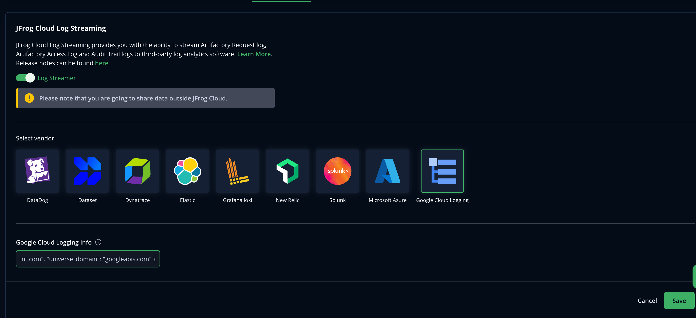

## Set up Cloud Log Streaming with Google Cloud Platform (GCP)


Steps to generate a service account authentication key in the Google Cloud Platform (GCP) console:

## Prerequisites
* You need access to a GCP project
* You need appropriate IAM permissions (Service Account Admin or Editor role)

## Steps to Generate Service Account Key
1. Access the GCP Console
   * Go to console.cloud.google.com
   * Sign in with your Google account
   * Select your project from the project dropdown

2. Navigate to Service Accounts
   * In the left navigation menu, go to IAM & Admin > Service Accounts
   * Or use the search bar and type "Service Accounts"

3. Create or Select Service Account

   `Option A`: Create New Service Account
   * Click "Create Service Account"
   * Enter a name and description
   * Click "Create and Continue"
   * Assign appropriate roles/permissions
   * Click "Done"
   
   `Option B`: Use Existing Service Account
   * Find your existing service account in the list
4. Generate the Key
   * Click on the service account email/name
   * Go to the "Keys" tab
   * Click "Add Key" > "Create new key"

5. Choose Key Format
   * Select key type:
   * JSON (recommended for most applications)
   * Click "Create"

6. Download and Secure the Key

#### Sample Key Format

```
{
"type": "<account type>",
"project_id": "<project id>",
"private_key_id": "<private key id>",
"private_key": "<private key>",
"client_email": "<client email>",
"client_id": "<client id>",
"auth_uri": "<auth uri>",
"token_uri": "<token uri>",
"auth_provider_x509_cert_url": "<auth provider x509 cert url>",
"client_x509_cert_url": "<client x509 cert url>",
"universe_domain": "googleapis.com"
}
```

### Perform the following steps to set up log streaming with Google Cloud Provider.

1. Go to the [MyJFrog Portal](http://my.jfrog.com/).

2. Additionally, you can access the MyJFrog Portal from the JFrog Platform. For more information, see [Platform Single Sign-On to MyJFrog](https://jfrog.com/help/r/5H19DEVA7PsahAXH0xXNSg/_iPFuW3rDQk_mlAk9URBkQ).
   
   Log into the JFrog Platform, and in the left navigation bar of the **Application** module, click **MyJFrog Portal**.
   This opens the **MyJFrog Portal** in a new tab in your browser.
> Note: You must be a Platform Admin to access the MyJFrog Portal via the JFrog Platform.


3. Select **Settings** from the left navigation menu.

4. Select the **JFrog Cloud Log Streaming** tab.

5. Turn on the **Log Streaming** toggle.

6. Select **Google Cloud Logging**.

7. Enter the above generated key.

8. Click **Save**.

