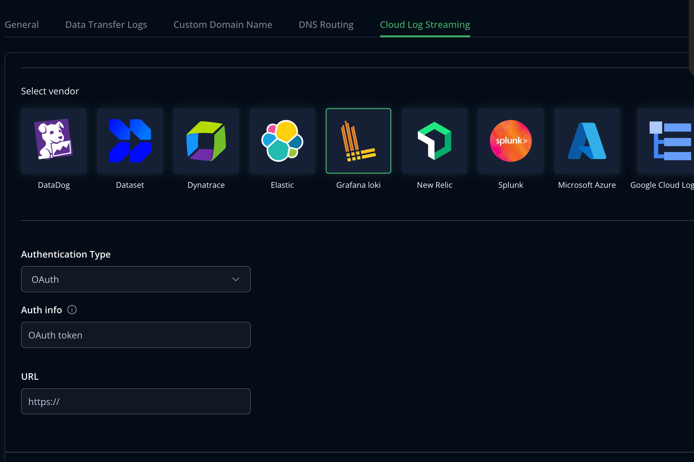

## Set up Cloud Log Streaming with Grafana Loki

Perform the following steps to set up log streaming with Grafana Loki with OAuth Token (only supported for self-hosted Grafana).

1. Create Loki Datasource

3. Create long-lived OAuth token for your Loki user, [documentation](https://grafana.com/docs/loki/latest/operations/authentication/).

4. Go to the [MyJFrog Portal](http://my.jfrog.com/).

5. Additionally, you can access the MyJFrog Portal from the JFrog Platform. For more information, see [Platform Single Sign-On to MyJFrog](https://jfrog.com/help/r/5H19DEVA7PsahAXH0xXNSg/_iPFuW3rDQk_mlAk9URBkQ).

> Note: You must be a Platform Admin to access the MyJFrog Portal via the JFrog Platform.

Log into the JFrog Platform, and in the left navigation bar of the **Application** module, click **MyJFrog Portal**.
This opens the **MyJFrog Portal** in a new tab in your browser.

6. Select **Settings** from the left navigation menu.

7. Select the **JFrog Cloud Log Streaming** tab.

8. Turn on the **Log Streaming** toggle.

9. Select **Grafana loki**.

10. Select **Authentication Type** as OAuth.

11. Enter the **OAuth Token** and **Loki URL**. Loki URL  can be found in the Loki Datasource settings, in the Connection and Authentication sections.

12. Click **Save**.