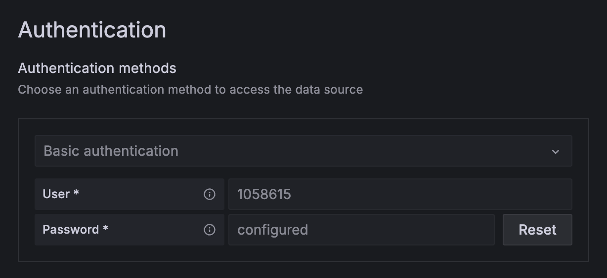
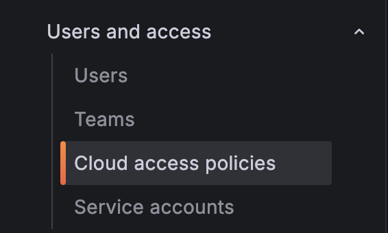
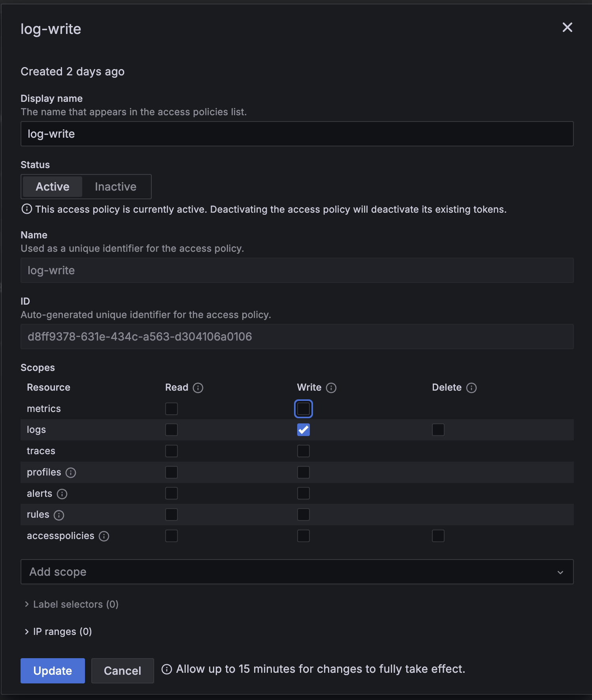
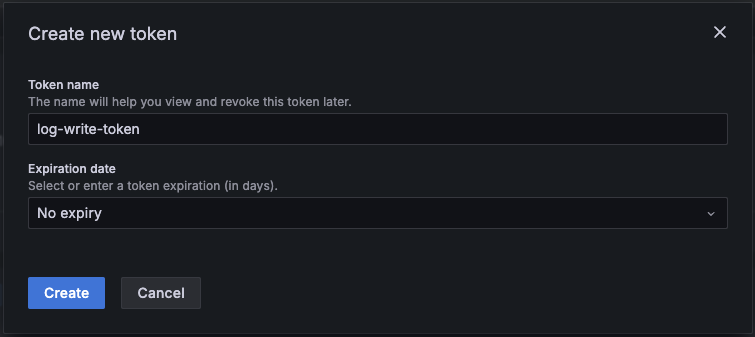
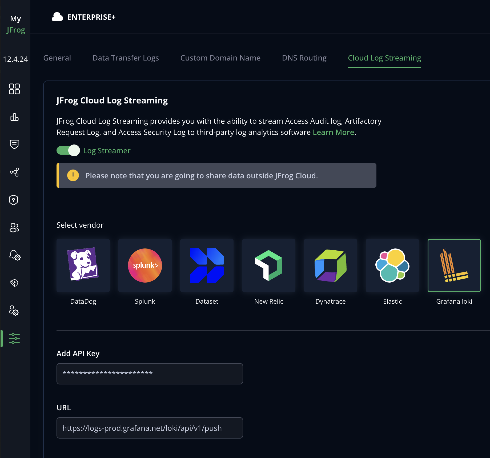

## Set up Cloud Log Streaming with Grafana Loki

Perform the following steps to set up log streaming with Grafana Loki.

1. Create Loki Datasource if self-hosted Grafana is used. The Loki Datasource is created by default in the cloud version. Only basic authentication is supported at the moment.

2. **Cloud version**: create a new Cloud access policy with **write** logs permissions.

Generate API token for this policy.

3. **Self-hosted version**: create API key for your Loki user.
4. Go to the [MyJFrog Portal](http://my.jfrog.com/).
5. Additionally, you can access the MyJFrog Portal from the JFrog Platform. For more information, see [Platform Single Sign-On to MyJFrog](https://jfrog.com/help/r/5H19DEVA7PsahAXH0xXNSg/_iPFuW3rDQk_mlAk9URBkQ).

> Note: You must be a Platform Admin to access the MyJFrog Portal via the JFrog Platform.

Log into the JFrog Platform, and in the left navigation bar of the **Application** module, click **MyJFrog Portal**.
This opens the **MyJFrog Portal** in a new tab in your browser.

6. Select **Settings** from the left navigation menu.

7. Select the **JFrog Cloud Log Streaming** tab.

8. Turn on the **Log Streaming** toggle.

9. Select **Grafana loki**.

10. Enter the **API key** and **Loki URL**. Loki URL can be found in the Datasource settings, in 

11. Click **Save**.