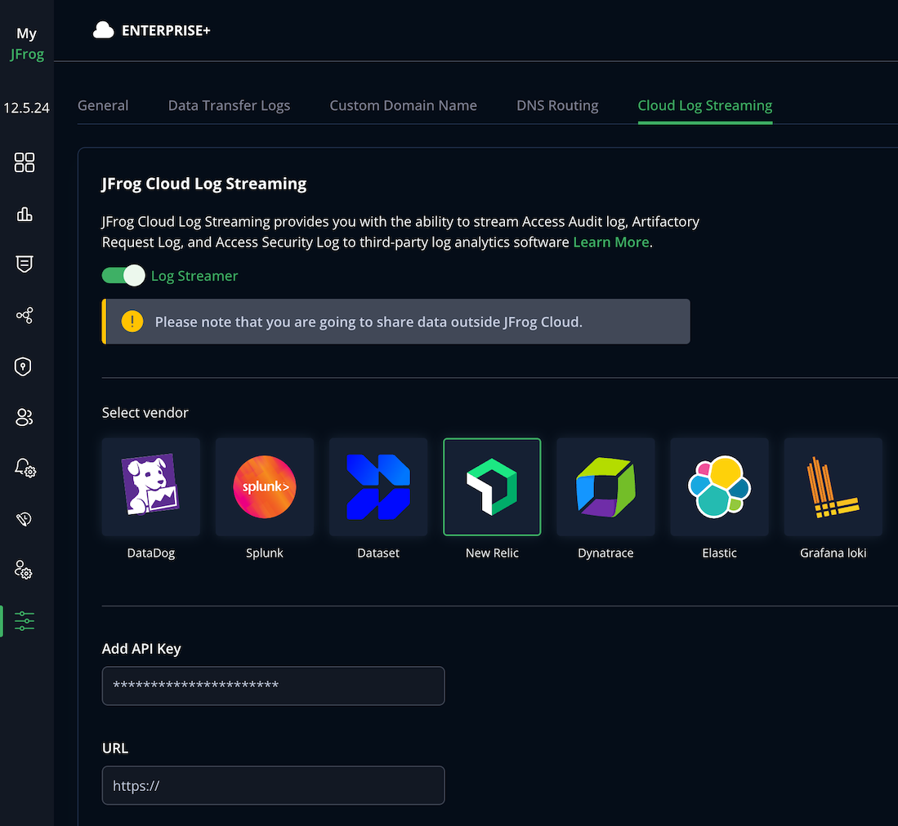

## Set up Cloud Log Streaming with New Relic

Perform the following steps to set up log streaming with New Relic.

1. In New Relic, click on your username on the bottom left of the screen, select the API Keys menu, and add a new key with INGEST - LICENSE or USER access.

2. Go to the [MyJFrog Portal](http://my.jfrog.com/).

3. Additionally, you can access the MyJFrog Portal from the JFrog Platform. For more information, see [Platform Single Sign-On to MyJFrog](https://jfrog.com/help/r/5H19DEVA7PsahAXH0xXNSg/_iPFuW3rDQk_mlAk9URBkQ).

> Note: You must be a Platform Admin to access the MyJFrog Portal via the JFrog Platform.

Log into the JFrog Platform, and in the left navigation bar of the **Application** module, click **MyJFrog Portal**.
This opens the **MyJFrog Portal** in a new tab in your browser.

4. Select **Settings** from the left navigation menu.

5. Select the **JFrog Cloud Log Streaming** tab.

6. Turn on the **Log Streaming** toggle.

7. Select **Splunk**.

8. Enter the **New Relic API key** and the **New Relic HTTP event collection URL**. You can find the New Relic HTTP event collection URL in the official [New Relic documentation](https://docs.newrelic.com/docs/logs/log-api/introduction-log-api/).

9. Click **Save**.

The example dashboard in JSON format can be found in the `dashboards` folder.