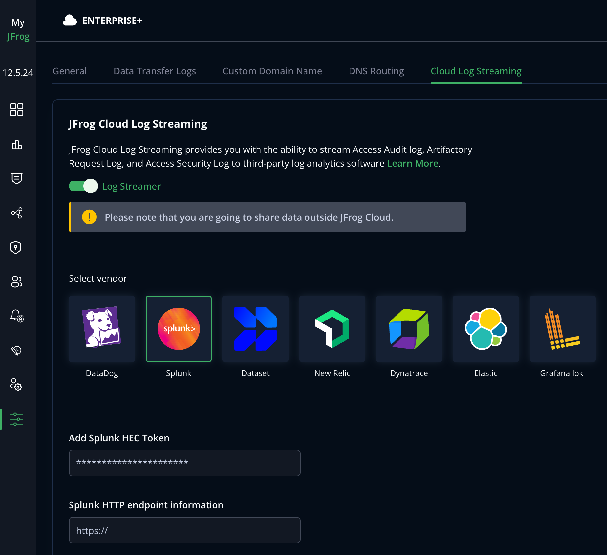

## Set up Cloud Log Streaming with Splunk

Perform the following steps to set up log streaming with Splunk.

1. If you have any firewall restrictions, whitelist your Artifactory region from this list.

2. Whitelist the following IPs for the management region:

```
52.206.165.145/32
3.218.212.121/32
3.95.51.114/32
3.216.224.216/32
```

3. In Splunk, generate the Splunk HEC token in **Settings > Data Inputs > HTTP Event Collector > Tokens**. For more information, see [Splunk Documentation](https://docs.splunk.com/Documentation/SplunkCloud/9.1.2308/Data/UsetheHTTPEventCollector#Configure_HTTP_Event_Collector_on_Splunk_Cloud_Platform).

4. Fetch the Splunk URL in the following format: `{hostname}/services/collector`

5. Go to the [MyJFrog Portal](http://my.jfrog.com/).

6. Additionally, you can access the MyJFrog Portal from the JFrog Platform. For more information, see [Platform Single Sign-On to MyJFrog](https://jfrog.com/help/r/5H19DEVA7PsahAXH0xXNSg/_iPFuW3rDQk_mlAk9URBkQ).

> Note: You must be a Platform Admin to access the MyJFrog Portal via the JFrog Platform.

Log into the JFrog Platform, and in the left navigation bar of the **Application** module, click **MyJFrog Portal**.
This opens the **MyJFrog Portal** in a new tab in your browser.

7. Select **Settings** from the left navigation menu.

8. Select the **JFrog Cloud Log Streaming** tab.

9. Turn on the **Log Streaming** toggle.

10. Select **Splunk**.



11. Enter the **Splunk HEC Token** and the **Splunk URL**.

12. Click **Save**.


